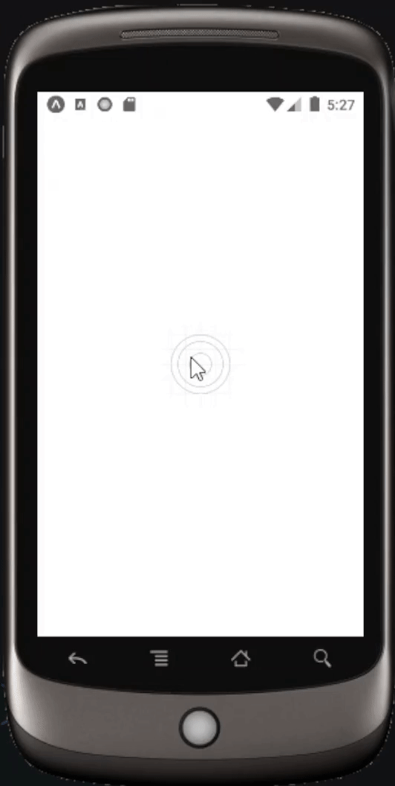

# Indice

- [Sobre](#-sobre)
- [Tecnologias](#Tecnologias)
- [Como baixar o projeto](#-como-baixar-o-projeto)

## 🔖&nbsp; Sobre

Projeto desenvolvido para ensinar como fazer um loader usando o básico do React Native e Expo.

---
## Tecnologias

Esse projeto foi desenvolvido com as seguintes tecnologias:

- [React-Native](https://reactnative.dev/)
- [Expo](https://expo.dev/)

## Como baixar o projeto

Clone o projeto e acesse a pasta

```bash
$ git clone https://github.com/filipeleonelbatista/React-Native-Loader.git
```

Siga os passos abaixo:
```bash
# Instalar as Dependências
$ npm i

# Iniciar o Servidor em Modo de Desenvolvimento
$ npm run start
```

---

<h3 align="center" >Vamos nos conectar 😉</h3>
<p align="center">
  <a href="https://www.linkedin.com/in/filipelbatista/">
    
  </a>&ensp;
  <a href="mailto:filipe.x2016@gmail.com">
    
  </a>&ensp;
  <a href="https://instagram.com/filipegaucho22">
    
  </a>
</p>
<br />
<p align="center">
    Desenvolvido 💜 por Filipe Batista 
</p>
